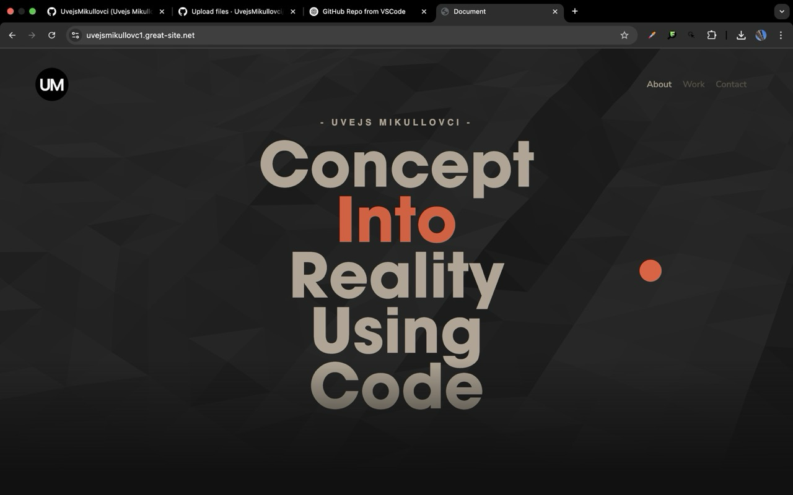

# 🌐 Old Portfolio Website

A personal portfolio website built using **HTML**, **CSS**, and **JavaScript**, featuring interactive backgrounds powered by **Vanta.js**. This project was an early showcase of my skills, creativity, and passion for frontend development.

---

## ✨ Features

- Responsive layout for mobile and desktop
- Smooth scroll and basic animations
- Interactive Vanta.js background effects
- Sections for:
  - About Me
  - Projects
  - Contact Form

---

## 🛠️ Technologies Used

| Language | Purpose         |
|----------|-----------------|
| HTML     | Page structure  |
| CSS      | Styling and layout |
| JavaScript | Interactivity and DOM manipulation |
| Vanta.js | Dynamic animated backgrounds |

---

## 📸 Screenshots

